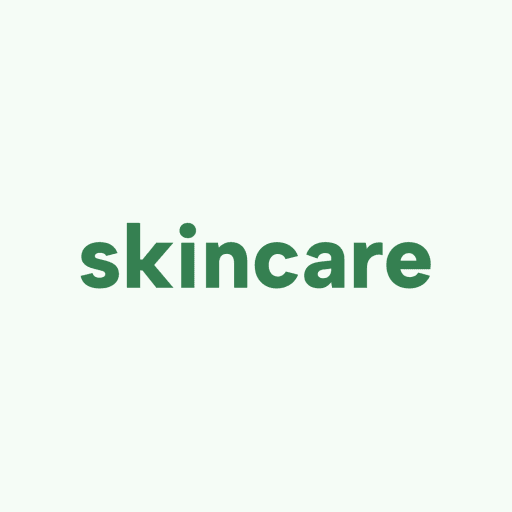

# SkinCare

> **Disclaimer**: ⚠️ **This application is currently under development.** Features may be incomplete, and you might encounter bugs. The UI and underlying data schema are subject to change.

SkinCare is a native Android application built with **Kotlin, Jetpack Compose, and Material 3**. It's a personal skincare-tracking app designed to help you monitor your skin condition over time. It uses AI to score your skin from photos, allowing you to track trends seamlessly.

## Features

- **Skin Tracking**: Capture daily photos and let AI analyze your skin metrics (acne, redness, texture, hydration) directly on your device.
- **Trend Charts**: Visual graphs of your skin's progress over time to see what routines are working.
- **Privacy-First**: No backend, no accounts, and no paywalls. Bring your own AI API key and all your data is stored locally via Room Database.

## Tech Stack

- **UI**: Jetpack Compose & Material 3 (Dynamic Color)
- **Local Storage**: Room (SQLite)
- **Security**: Jetpack Security (EncryptedSharedPreferences)
- **Networking**: Retrofit & OkHttp
- **Camera**: CameraX
- **Charts**: Vico Compose

## Getting Started

1. Clone the repository.
2. Open the project in Android Studio.
3. Build and run the app on an Android device or emulator.
4. Go to **Settings** and input your GLM AI API key to enable skin analysis.
